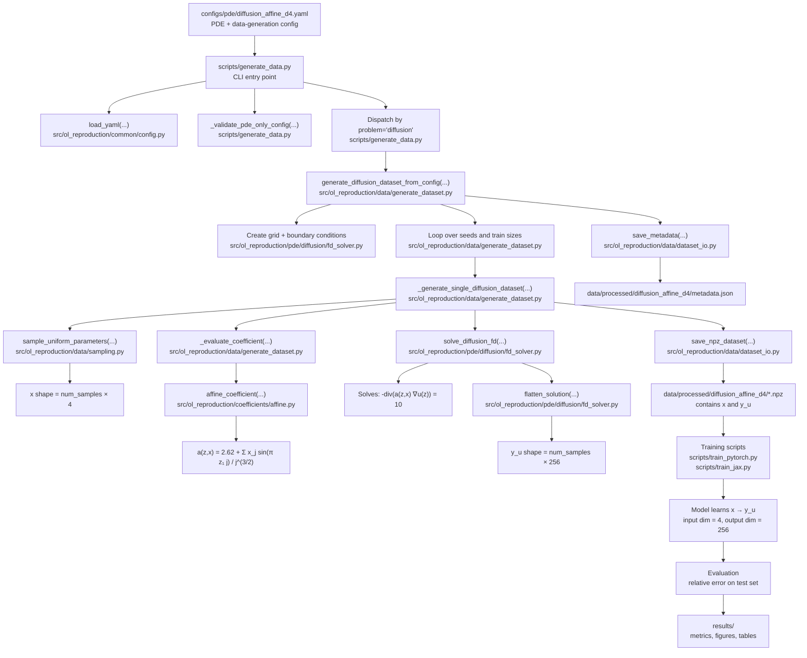

# Operator Learning Reproduction Project

This repository contains a practical reimplementation pipeline for the paper:

> **Generalization Error of Deep Operator Networks in Banach Spaces**  
> arXiv: 2406.13928

The goal of this project is to reproduce and investigate the main numerical ideas of the paper using a configurable Python implementation. The code supports data generation for parametric PDE problems, neural network training in PyTorch and JAX, evaluation of relative errors, plotting, and result summarization.

The implementation is designed as a practical reproduction framework. The diffusion experiment is implemented closest to the original setup. The Navier--Stokes--Brinkman and Boussinesq problems are implemented as simplified finite-difference analogues of the paper's mixed finite element benchmarks.

---

## Project Scope

The original paper uses FEniCS-based mixed finite element solvers to generate PDE data. In contrast, this repository uses finite-difference solvers for the main practical pipeline.

Implemented problems:

| Problem | Targets | Implementation status                                 |
|---|---:|-------------------------------------------------------|
| Diffusion equation | `u` | Evaluation needed                                     |
| Navier--Stokes--Brinkman | `u`, `p` | Finite difference method atm, still in dev            |
| Boussinesq | `u`, `phi`, `p` | Finite difference method atm, still in dev   |

Implemented frameworks:

| Framework | Status                   |
|---|--------------------------|
| PyTorch | Implemented, val needed  |
| JAX | Implemented , val needed |

Implemented model type:

| Model | Description |
|---|---|
| MLP | Fully connected feed-forward network |

Supported activations:

```text
relu
elu
tanh
````
Supported architectures:
```text
4 x 40
10 x 100
```

---

## Repository Structure

```text
operator-learning-reproduction/
│
├── configs/
│   ├── pde/
│   ├── model/
│   └── train/
│
├── data/
│   └── processed/
│
├── results/
│   ├── metrics/
│   ├── figures/
│   └── tables/
│
├── scripts/
│   ├── generate_data.py
│   ├── train_pytorch.py
│   ├── train_jax.py
│   ├── run_pytorch_sweep.py
│   ├── run_jax_sweep.py
│   ├── run_all_available.py
│   ├── plot_error_vs_m.py
│   ├── plot_activation_comparison.py
│   ├── plot_framework_comparison.py
│   └── summarize_results.py
│
├── src/
│   └── ol_reproduction/
│       ├── coefficients/
│       ├── common/
│       ├── data/
│       ├── evaluation/
│       ├── models/
│       ├── pde/
│       ├── plotting/
│       └── training/
│
└── tests/
```

---

## High-Level Pipeline

The complete workflow is:

```text
YAML configs
   ↓
PDE data generation
   ↓
NPZ datasets
   ↓
PyTorch / JAX training
   ↓
metrics CSV files
   ↓
plots and summary tables
```

The neural network does not solve the PDE directly during training. Instead, the PDE solver first generates supervised data pairs:

```text
x -> y
```

where:

```text
x = parameter vector
y = flattened PDE solution field
```

For example, in the diffusion experiment:

```text
x    shape: (m, d)
y_u  shape: (m, nx * ny)
```

For the Boussinesq experiment:

```text
x      shape: (m, d)
y_u    shape: (m, nx * ny * 2)
y_phi  shape: (m, nx * ny)
y_p    shape: (m, nx * ny)
```

---

## Configuration Files

The project is controlled through YAML files.

### PDE configs

Located in:

```text
configs/pde/
```

Example:

```yaml
experiment:
  name: diffusion_affine_d4
  problem: diffusion
  coefficient: affine
  dimension: 4
  target: u

data:
  train_sizes: [10, 20, 50, 100, 200, 500]
  test_size: 500
  seeds: [0, 1, 2]
  dtype: float32
```

Important PDE config fields:

| Field                    | Meaning                                                            |
| ------------------------ | ------------------------------------------------------------------ |
| `experiment.problem`     | PDE family: `diffusion`, `navier_stokes_brinkman`, or `boussinesq` |
| `experiment.coefficient` | Coefficient type: `affine` or `log`                                |
| `experiment.dimension`   | Parametric dimension `d`                                           |
| `target` / `targets`     | Output variables to learn                                          |
| `data.train_sizes`       | Training set sizes                                                 |
| `data.seeds`             | Random seeds / trials                                              |
| `paths.output_dir`       | Output directory for generated data                                |

### Model configs

Located in:

```text
configs/model/
```

Example:

```yaml
model:
  name: mlp_4x40_elu
  type: mlp
  depth: 4
  width: 40
  activation: elu

initialization:
  name: kaiming_uniform
```

Important model config fields:

| Field                 | Meaning                      |
| --------------------- | ---------------------------- |
| `model.depth`         | Number of hidden layers      |
| `model.width`         | Width of each hidden layer   |
| `model.activation`    | Activation function          |
| `initialization.name` | Weight initialization scheme |

### Training configs

Located in:

```text
configs/train/
```

Example:

```yaml
training:
  framework: pytorch
  optimizer:
    name: adam
    learning_rate: 1.0e-3
    weight_decay: 0.0
  scheduler:
    name: none
  batch_size: full
  epochs: 1000
  early_stopping:
    enabled: false
    patience: 100
    min_delta: 1.0e-8
  loss:
    name: mse
  device: auto
  dtype: float32
```

---

## Data Generation

Data is generated using:

```powershell
$env:PYTHONPATH = "src"

python scripts/generate_data.py `
  --pde configs/pde/diffusion_affine_d4.yaml
```

This creates files such as:

```text
data/processed/diffusion_affine_d4/train_m10_seed0.npz
data/processed/diffusion_affine_d4/train_m20_seed0.npz
data/processed/diffusion_affine_d4/test_seed0.npz
data/processed/diffusion_affine_d4/metadata.json
```

The generated `.npz` files contain arrays.

For diffusion:

```text
x
y_u
```

For Navier--Stokes--Brinkman:

```text
x
y_u
y_p
```

For Boussinesq:

```text
x
y_u
y_phi
y_p
```

---

## PDE Solvers

The main finite-difference solvers are located in:

```text
src/ol_reproduction/pde/
```

### Diffusion

File:

```text
src/ol_reproduction/pde/diffusion/fd_solver.py
```

The diffusion equation is the closest to the paper setup:

```text
-div(a(x) grad u(x)) = f
```

with:

```text
f = 10
u = 0.5 on the bottom boundary
u = 0 on the remaining boundary
```

### Navier--Stokes--Brinkman

File:

```text
src/ol_reproduction/pde/navier_stokes_brinkman/fd_solver.py
```

This solver is a simplified finite-difference Brinkman-type approximation. It produces:

```text
velocity target: y_u
pressure target: y_p
```

It is not an exact implementation of the paper's nonlinear mixed FEM Navier--Stokes--Brinkman solver.

### Boussinesq

File:

```text
src/ol_reproduction/pde/boussinesq/fd_solver.py
```

This solver is a simplified Boussinesq-style approximation. It first computes a scalar temperature field and then uses it to drive a simplified flow solve. It produces:

```text
velocity target: y_u
temperature target: y_phi
pressure target: y_p
```

It is not an exact implementation of the paper's 3D mixed FEM Boussinesq system.

---

## Coefficient Functions

Coefficient functions are implemented in:

```text
src/ol_reproduction/coefficients/
```

### Affine coefficient

File:

```text
src/ol_reproduction/coefficients/affine.py
```

The affine coefficient follows the paper structure:

```text
a(z, x) = 2.62 + sum_j x_j sin(pi z_1 j) / j^(3/2)
```

### Log-transformed coefficient

File:

```text
src/ol_reproduction/coefficients/log_transformed.py
```

The current implementation is a finite-dimensional log-transformed approximation compatible with the finite-difference solvers.

---

## Training

### Single PyTorch training run

```powershell
$env:PYTHONPATH = "src"

python scripts/train_pytorch.py `
  --dataset data/processed/diffusion_affine_d4 `
  --train-file train_m100_seed0.npz `
  --test-file test_seed0.npz `
  --target u `
  --model configs/model/mlp_4x40_elu.yaml `
  --train configs/train/pytorch_fast_debug.yaml
```

### Single JAX training run

```powershell
$env:PYTHONPATH = "src"

python scripts/train_jax.py `
  --dataset data/processed/diffusion_affine_d4 `
  --train-file train_m100_seed0.npz `
  --test-file test_seed0.npz `
  --target u `
  --model configs/model/mlp_4x40_elu.yaml `
  --train configs/train/jax_fast_debug.yaml
```

### Target selection

The training scripts use:

```text
--target u
--target p
--target phi
```

Internally this maps to:

```text
u   -> y_u
p   -> y_p
phi -> y_phi
```

This makes the same training code usable for all implemented PDEs and output variables.

---

## Sweeps

A sweep trains the same model over all available training sizes and seeds in a dataset directory.

### PyTorch sweep

```powershell
$env:PYTHONPATH = "src"

python scripts/run_pytorch_sweep.py `
  --dataset data/processed/nsb_affine_d4 `
  --target p `
  --model configs/model/mlp_4x40_elu.yaml `
  --train configs/train/pytorch_fast_debug.yaml `
  --output results/metrics/nsb_affine_d4_p_pytorch_mlp_4x40_elu_debug.csv
```

### JAX sweep

```powershell
$env:PYTHONPATH = "src"

python scripts/run_jax_sweep.py `
  --dataset data/processed/diffusion_affine_d4 `
  --target u `
  --model configs/model/mlp_4x40_elu.yaml `
  --train configs/train/jax_fast_debug.yaml `
  --output results/metrics/diffusion_affine_d4_u_jax_mlp_4x40_elu_debug.csv
```

---

## Metrics

Metrics are written to CSV files in:

```text
results/metrics/
```

Each row corresponds to one training run.

Typical columns:

```text
problem
target
framework
model
activation
depth
width
m_train
seed
final_train_loss
best_train_loss
relative_test_error
training_time_sec
epochs_ran
early_stopped
```

The main evaluation metric is the relative L2 test error:

```text
||y_true - y_pred||_2 / ||y_true||_2
```

---

## Plotting

### Error versus training size

```powershell
$env:PYTHONPATH = "src"

python scripts/plot_error_vs_m.py `
  --metrics results/metrics/diffusion_affine_d4_u_pytorch_mlp_4x40_elu_debug.csv `
  --output results/figures/diffusion_affine_d4_u_pytorch_mlp_4x40_elu_error_vs_m.png `
  --title "Diffusion, affine coefficient, d=4, solution, PyTorch ELU"
```

Figures are saved in:

```text
results/figures/
```

---

## Full Pipeline Execution

The script:

```text
scripts/run_all_available.py
```

is the main reproducibility entry point.

### Small default matrix

```powershell
$env:PYTHONPATH = "src"

python scripts/run_all_available.py --continue-on-error
```

Default mode runs:

```text
diffusion_affine_d4:
  target u

nsb_affine_d4:
  targets u, p

boussinesq_affine_d4:
  targets u, phi, p

model:
  mlp_4x40_elu

framework:
  PyTorch
```

### Dry run

```powershell
python scripts/run_all_available.py --dry-run
```

This prints the commands without executing them.

### Larger paper-like matrix

```powershell
python scripts/run_all_available.py --paper-matrix --dry-run
```

The paper-like matrix includes:

```text
d = 4 and d = 8
affine and log coefficients
4 x 40 and 10 x 100 architectures
ReLU, ELU and tanh activations
all available targets
```

This can be computationally expensive. Inspect with `--dry-run` before executing.

---

## Result Summarization

After sweeps are finished, summarize all metrics:

```powershell
$env:PYTHONPATH = "src"

python scripts/summarize_results.py --print-table
```

This creates:

```text
results/tables/summary_metrics.csv
```

The summary table includes:

```text
num_runs
num_train_sizes
num_seeds
best_relative_error
mean_relative_error
std_relative_error
mean_training_time_sec
total_training_time_sec
```

---

## Testing

Run all tests:

```powershell
$env:PYTHONPATH = "src"

python -m pytest -q tests
```

If FEniCS is not installed, FEniCS-specific functionality should not be treated as part of the default finite-difference test pipeline.

---

## Full pipeline execution example
