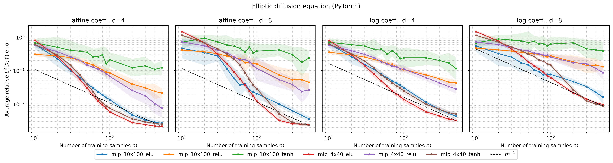
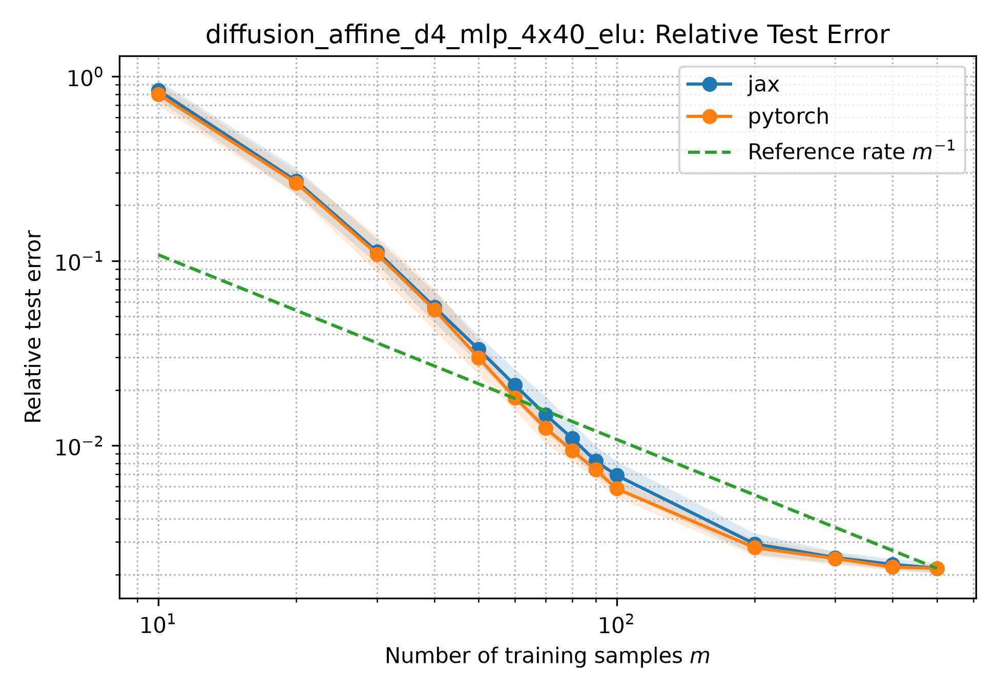
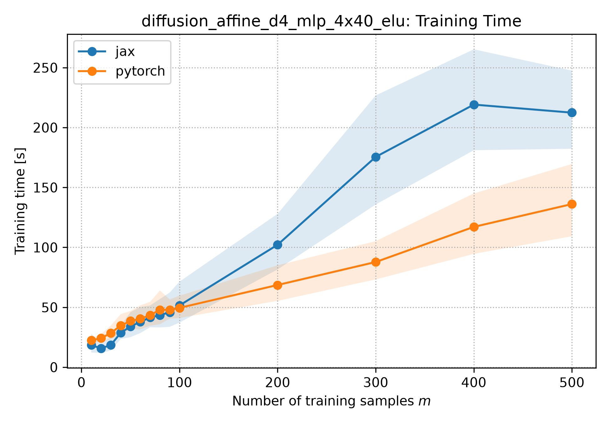
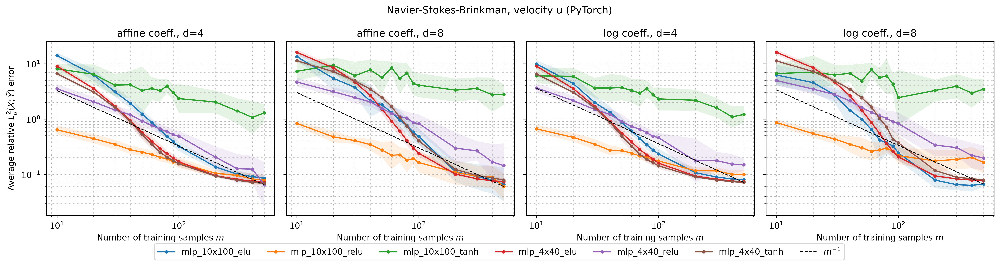
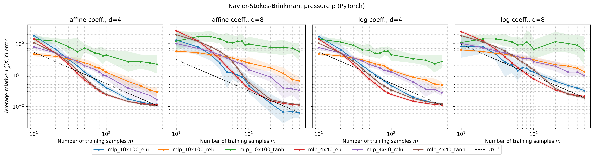

# Results at a Glance

Reproduction of Adcock, Dexter & Moraga, *"Optimal Deep Learning of Holomorphic
Operators Between Banach Spaces"* (arXiv:[2406.13928](https://arxiv.org/abs/2406.13928)),
for the parametric elliptic diffusion equation and the Navier–Stokes–Brinkman
(NSB) equations, in both PyTorch and JAX, at the paper's full experimental
matrix (2 coefficient families × 2 parametric dimensions × 6 architectures ×
14 training-set sizes × 12 trials, per PDE).

The mesh, finite element discretization, inlet boundary condition, pressure
gauge, sparse-grid test level, and test-error norm all now match the paper
authors' own released implementation exactly. This was verified directly
against their code and mesh file; see the report's appendix for the full
correction history. For the full methodology and the complete list of the
few genuinely remaining deviations, see the practical work report:
[`practical_work_report/main-thesis.pdf`](practical_work_report/main-thesis.pdf).

**Status: both experiments are complete.** 24,192 training runs finished
across both PDEs and both frameworks, 0 failures, 0 NaN. See
[Diffusion](#diffusion-equation-headline-comparison-to-the-paper) and
[Navier–Stokes–Brinkman](#navierstokesbrinkman-complete) below.

---

## Diffusion equation: headline comparison to the paper

| Paper's claim | Our result | Verdict |
|---|---|---|
| Relative test error decays roughly as $m^{-1}$ | Mean fitted log-log slope across all 48 (case × architecture × framework) combinations: **−1.02** (individual slopes range −1.88 to −0.14) | **Matches on average** |
| ELU/tanh architectures outperform ReLU | **Partially matches.** ELU beats ReLU cleanly at both sizes. Small (4×40) tanh matches ELU closely. Large (10×100) tanh is consistently the *worst* performer and visibly plateaus instead of converging | **Activation × size interaction, not a flat ranking** |
| PyTorch and JAX should agree closely (same protocol, same data) | Geometric-mean test-error ratio (PyTorch/JAX) is between **0.94 and 1.02** across all 4 cases | **Matches** |
| No degradation going from $d=4$ to $d=8$ | Tracks **architecture size**: 4×40 stays close to neutral (0.93–1.79×), 10×100 degrades more (1.44–2.82×), large tanh worst of all | **Partially matches**, see [dimension robustness](#dimension-robustness-d4-vs-d8) below |

PyTorch is now **consistently faster** than JAX for diffusion: 19–25% less
training time in every one of the 4 cases. (This is a reversal from an
earlier run of this same pipeline, which found the opposite; see the
report's discussion for why.)

### Reproduced Fig. 1-style plot (PyTorch)



Relative test error vs. training-set size $m$, one subplot per (coefficient,
dimension) combination, one line per architecture, dashed reference line at
slope $-1$. Note the green (10×100 tanh) line plateauing instead of
decaying in every panel. That is the activation × size interaction
discussed above, not noise. Generated directly from the real sweep metrics
via [`src/ol_reproduction/plotting/plot_paper_figure.py`](src/ol_reproduction/plotting/plot_paper_figure.py).

### PyTorch vs. JAX, best-performing architecture (`mlp_4x40_elu`, `diffusion_affine_d4`)

| Error | Training time |
|---|---|
|  |  |

### Error at the largest training-set size (m = 500)

Geometric mean over 12 trials, `diffusion_affine_d4` (representative case,
all 4 cases show the same activation × size pattern):

| Architecture | Activation | PyTorch | JAX |
|---|---|---:|---:|
| 4×40  | ELU  | 0.00216 | 0.00247 |
| 4×40  | tanh | 0.00248 | 0.00247 |
| 4×40  | ReLU | 0.00751 | 0.00987 |
| 10×100 | ELU  | 0.00266 | 0.00247 |
| 10×100 | ReLU | 0.02120 | 0.01736 |
| 10×100 | tanh | 0.12277 | 0.14711 |

(Full table across all 4 cases and both frameworks: `results/tables/diffusion_table_m500.csv`.)

### Dimension robustness (d=4 vs. d=8)

Ratio of geometric-mean error at $d=8$ to $d=4$, affine coefficient
(>1 means $d=8$ performs worse):

| Architecture | Ratio (d8/d4) |
|---|---:|
| 4×40 tanh  | 0.93 |
| 4×40 ELU   | 1.11 |
| 10×100 ELU  | 1.44 |
| 4×40 ReLU  | 2.82* |
| 10×100 tanh | 2.08 |
| 10×100 ReLU | 2.28 |

\* the log-transformed coefficient shows a milder pattern for 4×40 ReLU,
see the full table for both coefficient families.

The paper reports no degradation from $d=4$ to $d=8$. The reproduction
shows this is driven by **architecture size**, not activation: small
networks stay close to neutral, large networks degrade more, and large
tanh, already the worst performer in absolute terms, is also the least
dimension-robust.

(Full table: `results/tables/diffusion_table_dimension.csv`; slope-fit table:
`results/tables/diffusion_table_slopes.csv`; framework-ratio table:
`results/tables/diffusion_table_framework_ratio.csv`.)

---

## Navier–Stokes–Brinkman: complete

Data generation: all 4 cases (affine/log × $d\in\{4,8\}$), 0 non-converged
(excluded) samples across 24,000+ nonlinear mixed FEM solves, on the
authors' own mesh (143 vertices, 244 cells) with their exact AFW element
degrees (BDM2/DG1-vector/DG1/DG2-vector-3), constant inlet velocity, and
DG0 (unshifted) pressure gauge. Training: **16,128 / 16,128 runs complete,
0 failures, 0 NaN** (both frameworks, both targets $u$ and $p$, full paper
matrix).

One documented deviation applies here (see the report appendix): NSB
training uses a reduced epoch budget (20,000 epochs, $5\times10^{-6}$ loss
tolerance) instead of the paper's 60,000/$5\times10^{-7}$, because direct
measurement showed NSB runs routinely needing tens of thousands of epochs
to approach the paper's tolerance. The full paper-scale protocol was
measured at roughly 9 days of wall-clock time on the hardware available for
this practical work, which was not tractable. Diffusion is unaffected by
this change.

| Paper's claim | Our result | Verdict |
|---|---|---|
| Relative test error decays roughly as $m^{-1}$ | Fitted slope: **−0.989** ($u$), **−0.960** ($p$), averaged over all combinations | **Matches** |
| ELU/tanh outperform ReLU | **Partially matches**, more starkly than diffusion. Pooled at $m=500$: ELU best (0.0745 $u$ / 0.0130 $p$), but pooled tanh is now *worse* than ReLU (0.382/0.0706 vs. 0.122/0.0432), dragged down entirely by large (10×100) tanh, which plateaus around 80–370% relative error past $m\approx100$ in every case | **Same activation × size interaction as diffusion, more severe** |
| PyTorch and JAX should agree closely | Geometric-mean test-error ratio (PyTorch/JAX) between **0.94 and 1.01** across all 8 (case × target) combinations | **Matches** |
| No degradation from $d=4$ to $d=8$ | Same driver as diffusion, **architecture size**: 4×40 stays close to neutral (0.69–1.79×), 10×100 degrades more, large tanh worst (2.65×) | **Partially matches**, same pattern as diffusion, not a different one |

Framework timing shows a clean, unexpected split: PyTorch is **faster for
velocity ($u$)** in all 4 cases (27–38% less time), while JAX is **faster
for pressure ($p$)** in all 4 cases (20–34% less time). It is a
target-dependent split, not a case-dependent one, with no exceptions in
either direction.

### Reproduced Fig. 2-style plots (PyTorch)

| Velocity ($u$) | Pressure ($p$) |
|---|---|
|  |  |

Note the green (10×100 tanh) line in the velocity plot: it plateaus around
1–4× relative error past $m\approx100$ in every panel instead of
converging. This is the same activation × size pathology seen in
diffusion, just more pronounced.

### Error at m = 500, pooled over all cases/frameworks/architecture sizes

| Activation | Target $u$ | Target $p$ |
|---|---:|---:|
| ELU  | 0.0745 | 0.0130 |
| ReLU | 0.1222 | 0.0432 |
| tanh | 0.3819 | 0.0706 |

### Dimension robustness (d=4 vs. d=8), affine coefficient

Ratio of geometric-mean error at $d=8$ to $d=4$ (>1 means $d=8$ is worse),
averaged over $u$ and $p$. This is the same architecture-size-driven
pattern as diffusion:

| Architecture | NSB (avg. u, p) | Diffusion (for reference) |
|---|---:|---:|
| 10×100 ELU  | 0.69 | 1.44 |
| 4×40 ELU   | 0.99 | 1.11 |
| 4×40 tanh  | 1.13 | 0.93 |
| 10×100 ReLU | 1.48 | 2.28 |
| 4×40 ReLU  | 1.79 | 2.82 |
| 10×100 tanh | 2.65 | 2.08 |

An earlier run of this pipeline found *different* robustness drivers for
the two PDEs (activation for diffusion, size for NSB). The corrected,
paper-faithful discretization shows the **same** driver for both instead:
architecture size, with large tanh consistently worst. This is now
reported as one consistent cross-PDE finding rather than two separate
ones.

(Full tables: `results/tables/nsb_table_m500.csv`,
`results/tables/nsb_table_slopes.csv`,
`results/tables/nsb_table_framework_ratio.csv`,
`results/tables/nsb_table_dimension.csv`,
`results/tables/nsb_table_activation.csv`.)

---

## Bottom line

Both experiments, at the paper's full scale (24,192 completed training
runs across both PDEs and frameworks, 0 failures, 0 NaN), reproduce the
paper's central $m^{-1}$-decay claim, and ELU's advantage over ReLU is
completely robust. The paper's "ELU/tanh beat ReLU, no degradation at
$d=8$" claims hold only for a subset of the architectures the paper itself
tests: they're accurate for ELU (any size) and small tanh, but large tanh
is consistently the worst performer and least dimension-robust
architecture in *both* experiments. This activation × architecture-size
interaction is the report's central new empirical finding, and it only
surfaced after correcting the mesh/element discretization to match the
paper authors' own code exactly. See the report's Discussion and
Conclusion chapters for the full synthesis, including the several other
real bugs this correction process caught (documented in the appendix): a
wrong mesh/element pair, a hard-coded sparse-grid level, a
mischaracterized checkpoint rule, and a NaN-producing test-error formula
that needed the same `abs()`-before-`sqrt()` guard the paper authors' own
code uses.

---

## Reproducing these numbers

```powershell
$env:PYTHONPATH = "src"

# Full paper-scale training sweep (both frameworks, all 8 cases), 20-way parallel:
python scripts/run_parallel_sweep.py --paper-matrix --framework pytorch --workers 20 --resume
python scripts/run_parallel_sweep.py --paper-matrix --framework jax --workers 20 --resume

# Regenerate the summary tables from results/metrics/:
python scripts/generate_report_tables.py

# Regenerate the paper-style figures (see scripts/generate_report_tables.py's
# docstring / the plotting module for the exact calls used).
```

Data generation (the actual mixed FEM solves) requires FEniCS 2019.1.0 and
runs inside WSL2. See `scripts/wsl/` and the report's methodology chapter
for the full environment setup. All 8 datasets are already generated in this
repository's `data/processed/` (not committed to git due to size; see
`.gitignore` and the generation scripts to reproduce them).
